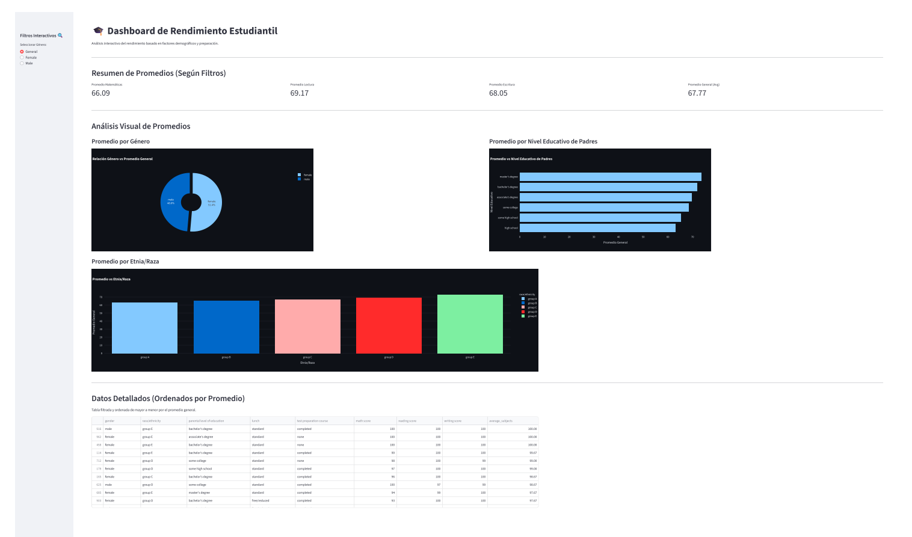

🎓 Dashboard de Rendimiento Estudiantil
Un dashboard interactivo creado con Streamlit y Plotly para analizar el rendimiento académico de estudiantes, basado en factores demográficos y de preparación.

Demo

Descripción General
Este proyecto utiliza un conjunto de datos (ficticio o real) sobre el rendimiento de estudiantes para explorar cómo diferentes variables influyen en las puntuaciones de matemáticas, lectura y escritura.

El dashboard permite a los usuarios filtrar los datos y visualizar los resultados de forma dinámica, facilitando la identificación de patrones y tendencias.

🚀 Características Principales
Métricas Clave (KPIs): Tarjetas de resumen que muestran los promedios de matemáticas, lectura, escritura y el promedio general, actualizadas según los filtros aplicados.

Filtro Interactivo: Un filtro en la barra lateral (st.radio) permite segmentar el análisis por género (General, Female, Male).

Visualizaciones Dinámicas (Plotly):

Gráfico de Pastel (Género): Muestra la proporción del promedio general por género (visible solo cuando se selecciona "General").

Gráfico de Barras Horizontales (Nivel Educativo): Compara el promedio general de los estudiantes basado en el nivel educativo de sus padres.

Gráfico de Barras Verticales (Etnia/Raza): Compara el promedio general entre diferentes grupos étnicos/raciales.

Tabla de Datos Detallada: Un st.dataframe que muestra los datos filtrados y ordenados descendentemente por el promedio general.

💻 Tecnologías Utilizadas
Python 3.x

Streamlit: Para la creación de la aplicación web interactiva.

Pandas: Para la carga, limpieza y manipulación de datos.

Plotly Express: Para la generación de gráficos interactivos.

Numpy: (Usado implícitamente por Pandas/Plotly para cálculos).

📂 Estructura del Proyecto
tu-repositorio/
│
├── dashboard.py             # El script principal de la aplicación Streamlit
├── StudentsPerformance.csv  # El conjunto de datos (requerido)
├── requirements.txt         # El archivo de dependencias
└── README.md                # Este archivo
🛠️ Instalación y Uso
Sigue estos pasos para ejecutar el dashboard en tu máquina local.

1. Prerrequisitos
Python 3.8 o superior.

pip (manejador de paquetes de Python).

2. Clonar el Repositorio
Bash

git clone https://github.com/tu-usuario/tu-repositorio.git
cd tu-repositorio
3. Crear un Entorno Virtual (Recomendado)
Bash

# Windows
python -m venv venv
venv\Scripts\activate

# macOS / Linux
python3 -m venv venv
source venv/bin/activate
4. Instalar las Dependencias
Crea un archivo requirements.txt en la raíz de tu proyecto con el siguiente contenido:

requirements.txt

Plaintext

streamlit
pandas
plotly
numpy
Luego, instálalo usando pip:

Bash

pip install -r requirements.txt
5. Obtener los Datos
Este dashboard requiere el archivo StudentsPerformance.csv. Asegúrate de que este archivo esté en el mismo directorio que dashboard.py.

Nota: El script de Python asume que las columnas del CSV están en inglés (ej. math score, gender, race/ethnicity).

6. Ejecutar la Aplicación
Una vez instaladas las dependencias y con el archivo CSV en su lugar, ejecuta el siguiente comando en tu terminal:

Bash

streamlit run dashboard.py

Streamlit abrirá automáticamente el dashboard en tu navegador web predeterminado.

